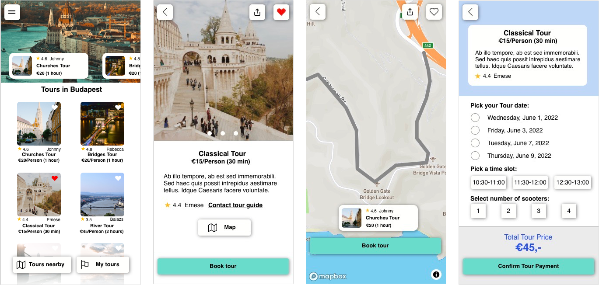

# Tier Guided Tours

This challenge is part of the CraftHack 2022 Hackathon (May 6 - 8). The challenge description is here: https://crafthack.crafthub.events/TIER%20challenge_CraftHack_2022.pdf

## How to Run the Web App
The solution presented in this repository was created using _Tumult Hype 4_  and integrates with _MapBox_. The solution can be found here online: https://marincomics.com/tier-tours/tier-guided-tours.html Please kindly note that all the features of this web prototype work fine on a desktop browser but the maps will not work in Safari on an iPhone unless you use the function "Add to Home Screen" and then launch it from there.

Of course, you can clone the repository and run _tier-guided-tours.html_ locally.

## The Solution
This feature provides users with the option to book guided tours across town with their friends and a tour guide. It offers infos about the tour, instructions and map routes.

During the tour, users can get turn-by-turn navigation when a user's phone is secured in the charging tray on the Tier scooter (BTW, the charging tray is a unique feature of Tier.) Users can contact the tour guide and get warnings if they or their friends have accidentally left the tour route. All the map features make use of _MapBox_.

Please find the concept sketches that I created before the implementation here: https://github.com/mbalabanov/tier-guided-tours/blob/main/tier-guided-tours-marin-balabanov.pdf
